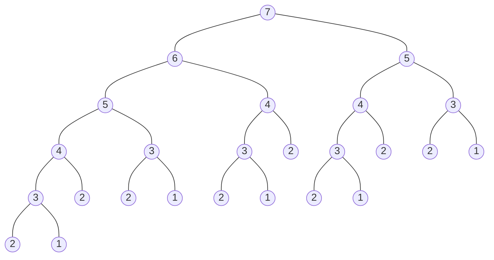
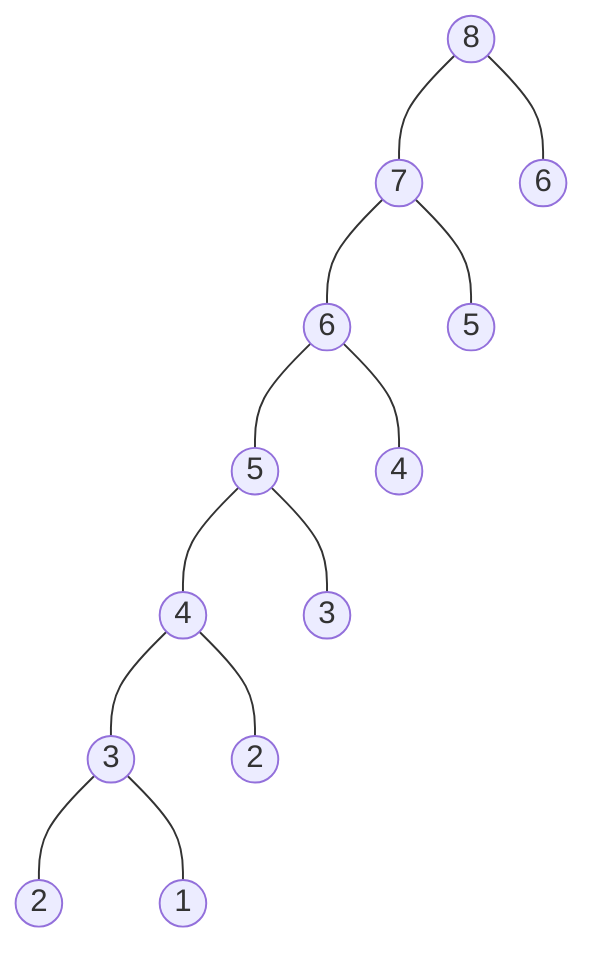
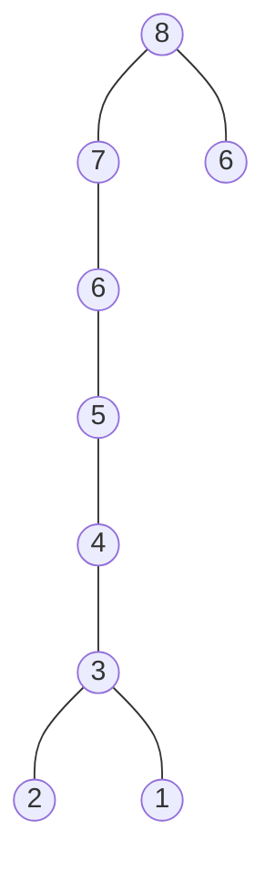

# Dynamic Programming

Learn to Solve Algorithmic Problems & Coding Challenges:
https://youtu.be/oBt53YbR9Kk

## fibonacci

The recursive fibonacci code can be written like this:

```js
let fib = n => (
  n < 3
    ? 1
    : fib (n - 1) + fib (n - 2)
)
````

```
fib (7) -> 13
```



```
O(2ⁿ) time
O(n) space
```

### memorization fibonacci

```js
let fib2 = (n, memo = {}) => {
  if (n in memo) return memo[n];
  if (n <= 2) return 1;

  memo[n] = fib2 (n - 1, memo) + fib2 (n - 2, memo);
  return memo[n];
}
```

```
fib (8) -> 21
```



```
O(n) time
O(n) space
```

A generic memoization function that can decorate a monadic
function, that is a function that takes one argument, can be
written like so:

```js
let memo = (f, o = {}) => (
  a => (
    a in o
      ? o[a]
      : (o[a] = f (a), o[a])
  )
)
```

Used to re-write `fib` looks like this:

```js
fib = memo (fib)
```

```
fib (8) -> 21
```


