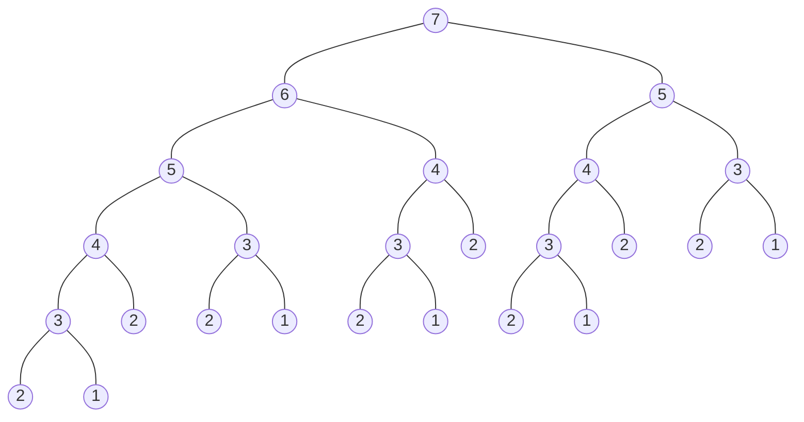

# Dynamic Programming

Learn to Solve Algorithmic Problems & Coding Challenges:
https://youtu.be/oBt53YbR9Kk

## fibonacci

```js
const fib = n => (
  n < 3
    ? 1
    : fib (n - 1) + fib (n - 2)
)
````

```
fib (7) -> 13
```


